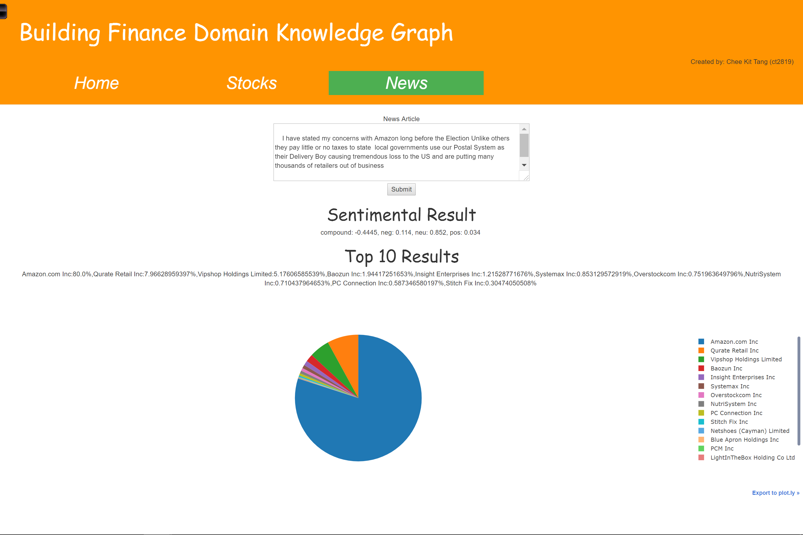
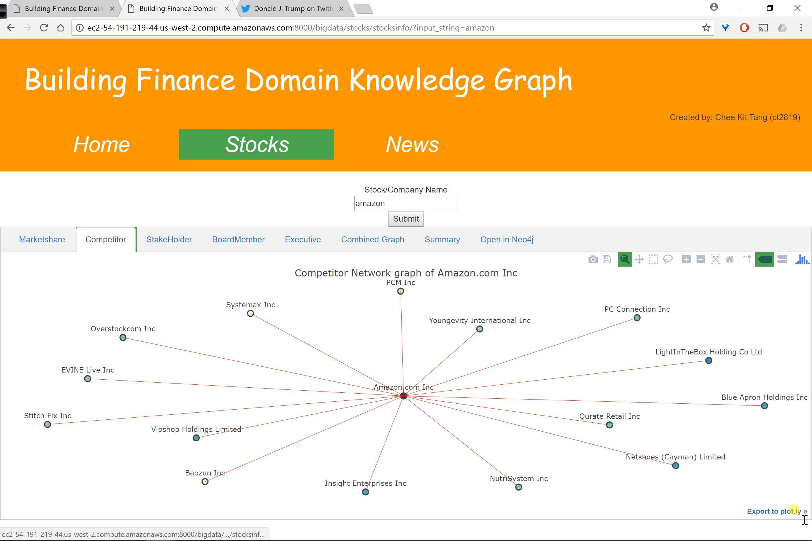

# bigdata
This is a project written to fulfill the requirements of Advanced Big Data Analytics.

## Django
This is the folder containing codes up to milestone 3 changes.

The html server can be executed by running the manage.py in django folder.

For security reasons:
The secret key for django server is removed in django\big_data\settings.py line 22.
The allowed_hosts is changed in django\big_data\settings.py line 27.
The password for neo4j is changed to root in django\stocks\views.py line 435.

Please generate your unique secret key for django server, update the allowed_hosts and key in your own neo4j server password in order to make it works

## django_final_proj
This is the folder containing codes up to final project changes.

The html server can be executed by running the manage.py in django folder.

For security reasons:
The secret key for django server is removed in django\big_data\settings.py line 22.
The allowed_hosts is changed in django\big_data\settings.py line 27.
The password for neo4j is changed to root in django\stocks\views.py line 647.

Please generate your unique secret key for django server, update the allowed_hosts and key in your own neo4j server password in order to make it works.
